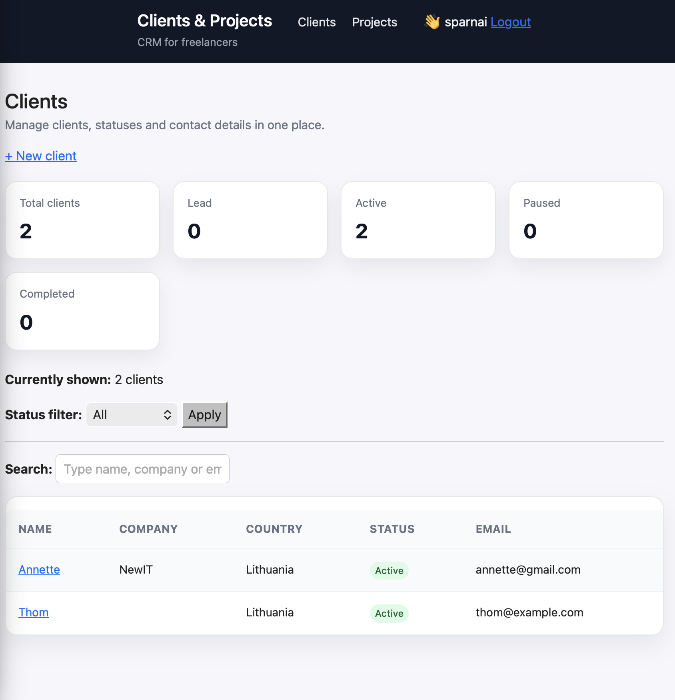
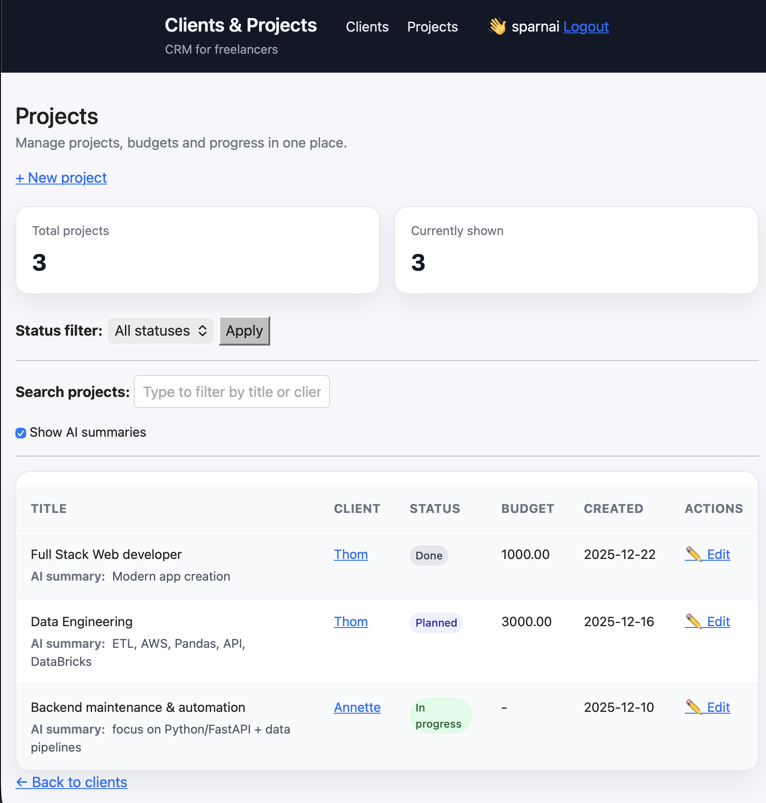
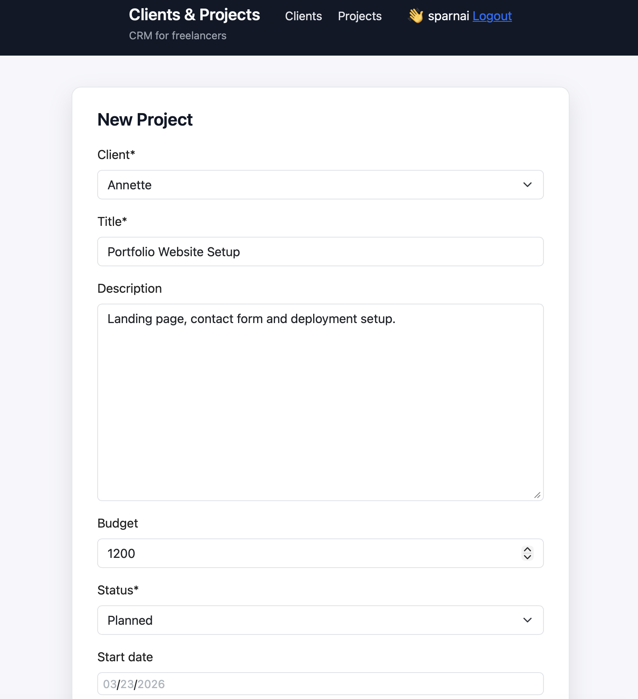

# Clients & Projects

A lightweight Django CRM for freelancers to manage clients, projects and tasks.

### Highlights
- Django web app with clean HTML UI
- Django REST Framework API for clients and projects
- Optional AI-generated project summaries
- Dockerized local setup
- Basic automated tests for models, API and management commands

---

## 🌟 Tech Stack

- **Backend:** Django (Python)
- **API:** Django REST Framework (clients & projects endpoints)
- **Templating:** Django templates (HTML)
- **Database:** SQLite by default (PostgreSQL planned via Docker)
- **Containerization:** Docker, docker-compose
- **Forms:** Django `ModelForm` + crispy-forms
- **Testing:** Django `TestCase`, DRF `APITestCase`, management command tests
- **Styling / JS:**
  - custom CSS,
  - small vanilla JavaScript helpers (live search, AI summary toggle).

---

## 📸 Screenshots

### Clients dashboard


### Projects dashboard


### Project form


## ✅ Prerequisites

To run the project you’ll need:

- **Git** – to clone the repository  
  https://git-scm.com/downloads  

- **Docker** (recommended way to run)  
  - Docker Desktop (macOS / Windows)  
  - Docker Engine (Linux)  
  https://docs.docker.com/get-docker/

Optional (only if you want to run without Docker):

- **Python 3.11+**  
  https://www.python.org/downloads/  

Any editor/IDE works:

- PyCharm Community Edition, VS Code, or any other editor that supports Python.

---

## 📥 Clone the Repository

```bash
git clone https://github.com/Annette3125/freelancer-crm.git
cd freelancer-crm
```

🚀 Option A – Run with Docker (recommended)

You don’t need a local Python setup for this option – everything runs inside Docker.

1. Environment file

Copy the sample env file:

```bash
cp .env.sample .env
```

Edit .env and set your own secret key (example):
```bash
DJANGO_SECRET_KEY=your-very-secret-key-here
DEBUG=True
```

2. Build and start the app

```bash
docker compose build
docker compose up
```

On first run, apply migrations (inside the container):
```bash
docker compose exec web python manage.py migrate

```
(If you change models and add new migrations later, you can run makemigrations + migrate in the same way.)

3. Admin user (optional)

```bash
docker compose exec -it web python manage.py createsuperuser
```

4. URLs
	•	Home: http://127.0.0.1:8002/
	•	Clients list: http://127.0.0.1:8002/clients/
	•	Projects list: http://127.0.0.1:8002/clients/projects/
	•	Admin: http://127.0.0.1:8002/admin/

To stop the app:
```bash
docker compose down
```
ℹ️ For demo purposes, the repository may include a small SQLite database 
(db.sqlite3) with sample clients and projects. If present, you’ll see example data right after starting the app.


🧪 Option B – Run locally (without Docker)

If you prefer to run Django directly on your machine.

1. Create a virtual environment

From the project root:

Linux/macOS:

```bash
python3 -m venv venv
source venv/bin/activate
```

Windows (PowerShell):

```bash
python -m venv venv
.\venv\Scripts\Activate.ps1
```

Windows (CMD):

```bash
python -m venv venv
venv\Scripts\activate.bat
```

2. Upgrade pip

```bash
python -m pip install --upgrade pip
```

3. Install dependencies

```bash
pip install -r requirements.txt
```

4. Environment file

```bash
cp .env.sample .env
```

The values in .env.sample are only examples, not real secrets.

Edit .env:
```bash
DJANGO_SECRET_KEY=your-very-secret-key-here
DEBUG=True
# Optional: OpenAI API key for AI project summaries
OPENAI_API_KEY=
```


5. Apply migrations and run the server

```bash
python manage.py migrate
python manage.py runserver 8002
```
Open:
	•	http://127.0.0.1:8002/

## ✅ Tests

This project includes a small but growing test suite:

- Django `TestCase` for core models (`Client`, `Project`)
- DRF `APITestCase` for API endpoints (`/api/clients/`, `/api/projects/`)
- Tests for the `generate_project_summaries` management command

Run tests in Docker (recommended):

```bash
docker compose exec web python manage.py test
```

If you run the project without Docker, you can use:

```bash
python manage.py test
```

AI summaries (optional):

- If you set `OPENAI_API_KEY` in `.env`, the management command  
  `docker compose exec web python manage.py generate_project_summaries`  
  will use OpenAI to generate short summaries.

- If `OPENAI_API_KEY` is not set or something goes wrong,
  the app falls back to a simple truncated description
  and the UI still works.


## 🌟 Features

- **Clients management**
  - Create, edit and list clients
  - Store company name, country, status, notes
  - Optional links: GitHub, LinkedIn, personal website
  - Avatar URL support

- **Projects management**
  - Create projects and link them to clients
  - Track project status (Planned / In progress / On hold / Done)
  - Store budget, description, AI summary
  - See all projects for a specific client

- **Smart status automation**
  - `post_save` signal updates client status based on project statuses
  - e.g. if any project is active → client becomes "Active"

- **Clean relationships**
  - `Client` ↔ `Project` via `ForeignKey`
  - Reverse access: `client.projects.all()` using `related_name`

- **REST API**
  - `/api/clients/` – list & create clients
  - `/api/clients/<id>/` – retrieve / update / delete client
  - `/api/projects/` – list & create projects
  - `/api/projects/<id>/` – retrieve / update / delete project

- **Web UI**
  - HTML templates with inheritance (`base.html`)
  - Clients dashboard, client detail view, projects dashboard
  - Styled forms for client and project create/update flows
  - Simple navigation between clients and projects

- **Dockerized setup**
  - Application runs inside a Docker container
  - Easy to start and stop locally

- **AI summaries (optional)**
  - Management command `generate_project_summaries`
  - If `OPENAI_API_KEY` is set – uses OpenAI to generate a short summary
  - If not – falls back to a truncated description (no external calls)

- **UI & JS**
  - Dashboard-style clients and projects views with summary cards
  - Clients & projects tables with status badges
  - Live search:
    - client list (filters as you type)
    - project list (by title or client name)
  - Toggle "Show AI summaries" on the projects page

- **Auth**
  - Sign up, login, logout
  - Only authenticated users can manage clients & projects (`login_required`)

This project is actively evolving — I’m extending it step by step with new features, tests and UI improvements.

### 🔭 Planned / Next Steps

- **API auth & permissions**
  - protect DRF endpoints (token- or session-based auth)
- **Database**
  - optional switch to PostgreSQL in Docker setup
- **Frontend polish**
  - responsive layout for mobile screens
  - additional UI refinements
- **Tests**
  - extend coverage (more views, forms and API cases)
- **AI layer**
  - additional AI helpers (e.g. summary improvements, client notes suggestions)

---

##### Disclaimer

This repository is part of my personal portfolio.  
It is intended for educational and demonstration purposes only.  
Not production-ready without further hardening and security review.


## About me

I enjoy building backend tools with Python and Django.  
I like taking the time to understand how things work under the hood  
and to build projects like this one.

******
******
✨
******
******
